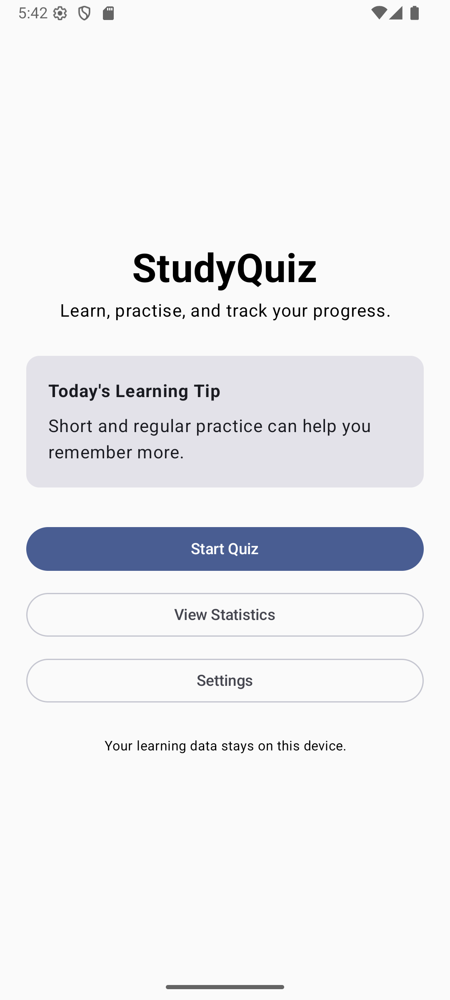
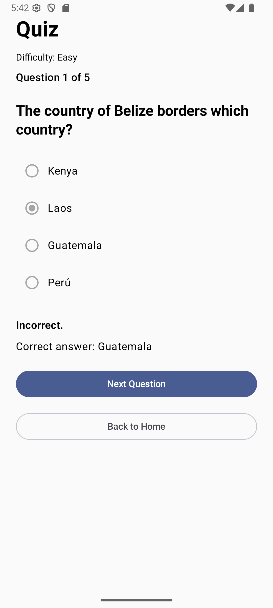
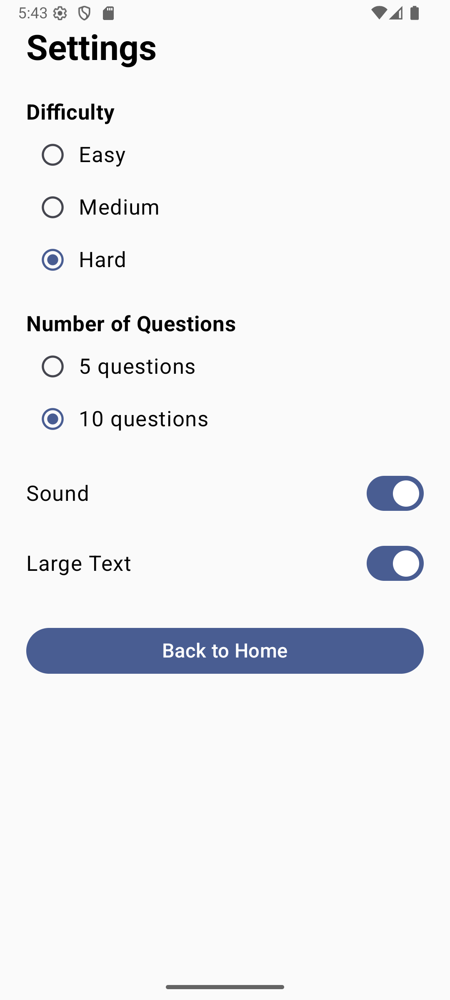
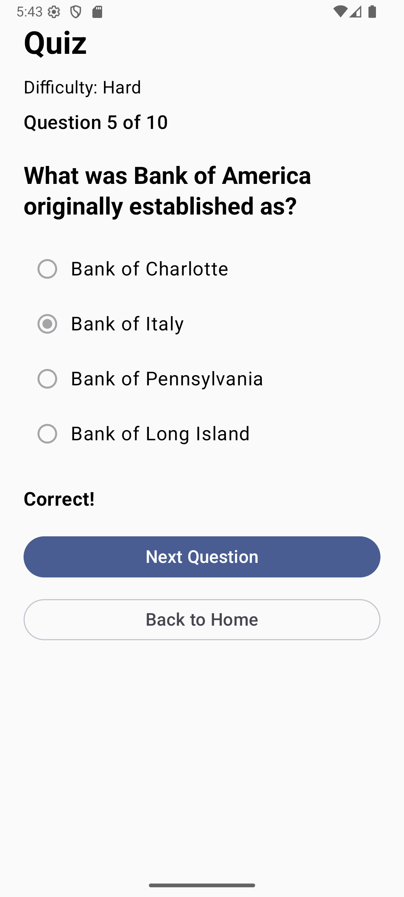
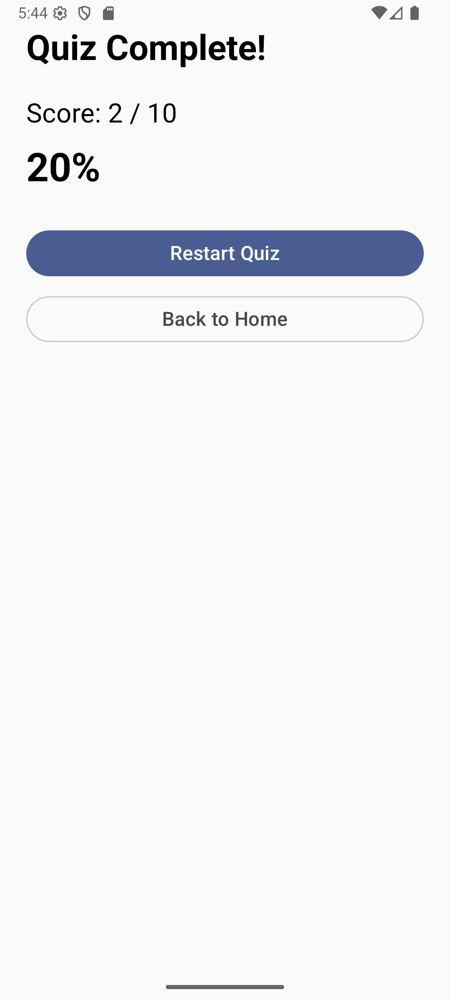
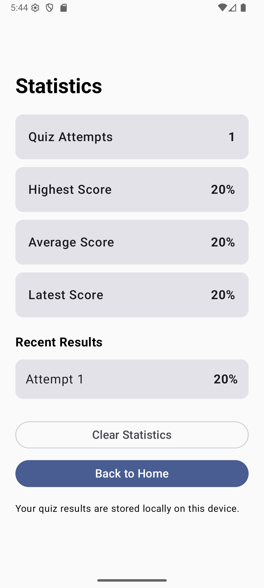

# StudyQuiz

StudyQuiz is an Android educational quiz application developed for CP3406 Mobile Computing Assessment 3.

The application is designed for university students who want to practise quiz questions, receive immediate feedback, and track their learning progress.

StudyQuiz combines online quiz content, local data storage, accessibility options, and responsible mobile application design in a single Android application.

---

## Project Overview

StudyQuiz allows users to:

- Complete multiple-choice quizzes
- Choose quiz difficulty
- Choose the number of questions
- Receive immediate answer feedback
- Enable or disable sound feedback
- Use a Large Text accessibility option
- Track quiz performance
- Store quiz statistics locally
- Clear stored statistics
- Continue using offline fallback questions when the online API is unavailable

The application was developed using Kotlin and Jetpack Compose.

---

## Target Users

The main target users are university students who want a simple and accessible mobile application for practising quiz questions.

The application focuses on:

- Simple navigation
- Clear feedback
- Accessibility
- Privacy
- Reliable quiz functionality
- Easy progress tracking

---

## Screenshots

### Landing Screen


### Settings Screen


### Quiz - Incorrect Answer


### Quiz - Correct Answer


### Quiz Complete


### Statistics Screen


---

## Core Screens

StudyQuiz contains four main screens.

### 1. Landing Screen

The Landing Screen is the main entry point of the application.

Users can:

- Start a quiz
- Open the Statistics Screen
- Open the Settings Screen

The screen also displays a privacy message informing users that their learning data stays on their device.

### 2. Quiz Screen

The Quiz Screen provides the main learning activity.

Features include:

- Online multiple-choice questions
- Current question number
- Total number of questions
- Selected difficulty display
- Answer selection
- Submit Answer button
- Correct feedback
- Incorrect feedback
- Correct answer display after an incorrect response
- Next Question button
- Final quiz score
- Percentage result
- Restart Quiz option
- Back to Home option
- Scrollable content for long questions and smaller screens

The quiz content is retrieved from an external API.

If the API is unavailable, StudyQuiz automatically uses built-in offline questions.

### 3. Settings Screen

The Settings Screen allows users to control their quiz experience.

#### Difficulty

Users can choose:

- Easy
- Medium
- Hard

The selected difficulty is sent to the online quiz API.

#### Number of Questions

Users can choose:

- 5 questions
- 10 questions

The selected question count controls the number of questions requested from the API.

#### Sound

Users can enable or disable sound feedback.

When sound is enabled:

- Correct answers produce a short positive sound
- Incorrect answers produce a different feedback sound

When sound is disabled, no answer sound is played.

#### Large Text

Users can enable Large Text mode.

Large Text increases the text scale across the application to improve accessibility and readability.

### 4. Statistics Screen

The Statistics Screen displays locally stored quiz performance.

The screen shows:

- Quiz Attempts
- Highest Score
- Average Score
- Latest Score
- Recent Results

Users can also select:

- Clear Statistics

This removes locally stored quiz result data.

---

## Main Features

StudyQuiz includes:

- Jetpack Compose user interface
- Material Design 3 components
- Navigation between four core screens
- Online API integration
- Offline fallback quiz questions
- Difficulty selection
- Question count selection
- Quiz scoring
- Immediate answer feedback
- Sound feedback
- Large Text accessibility setting
- Room database
- Local quiz statistics
- Recent quiz history
- Clear statistics function
- Unit testing
- Compose UI testing
- MVVM-style architecture
- Repository pattern
- Manual dependency injection

---

## Technologies Used

StudyQuiz uses:

- Kotlin
- Android Studio
- Jetpack Compose
- Material Design 3
- Navigation Compose
- ViewModel
- StateFlow
- Kotlin Coroutines
- Retrofit
- Gson Converter
- Room Database
- KSP
- JUnit
- Jetpack Compose UI Testing

---

## External API

StudyQuiz uses the Open Trivia Database API to retrieve online multiple-choice questions.

API:

`https://opentdb.com/`

The application sends quiz settings such as:

- Number of questions
- Difficulty
- Question type

Example behaviour:

- Easy + 5 questions requests 5 easy questions
- Medium + 10 questions requests 10 medium questions
- Hard + 10 questions requests 10 hard questions

The application uses Retrofit to communicate with the API.

---

## Offline Fallback

Internet access may not always be available.

To improve reliability, StudyQuiz contains built-in fallback questions.

If online questions cannot be loaded:

1. The application catches the API error.
2. Offline questions are loaded.
3. A message informs the user that online questions could not be loaded.
4. The user can continue using the quiz.

This prevents the application from becoming unusable during network problems.

---

## API Text Handling

Some online quiz questions contain HTML encoded text.

For example:

`&quot;`

StudyQuiz decodes these values before displaying them.

This improves readability and ensures questions are shown correctly to users.

---

## Local Database

StudyQuiz uses Room Database for persistent local quiz statistics.

Quiz results are stored in the local database after a quiz is completed.

Each result contains:

- Score
- Total number of questions
- Percentage
- Completion time

The application uses this stored data to calculate statistics.

---

## Statistics Calculation

The Statistics Screen calculates:

### Total Attempts

The number of completed quizzes stored in Room.

### Highest Score

The highest percentage score recorded.

### Average Score

The average percentage across all stored quiz attempts.

### Latest Score

The percentage from the most recently completed quiz.

### Recent Results

The most recent quiz results are displayed to the user.

---

## Architecture

StudyQuiz follows an MVVM-style application architecture.

The main structure is:

```text
UI Layer
    |
    v
ViewModel Layer
    |
    v
Repository Layer
    |
    +-------------------+
    |                   |
    v                   v
Remote API          Room Database
```

The architecture separates:

- UI
- UI state
- Business logic
- API communication
- Local database operations

This makes the application easier to maintain and test.

---

## Package Structure

```text
com.sihan.studyquiz
│
├── data
│   ├── local
│   ├── remote
│   └── repository
│
├── di
│
├── model
│
├── navigation
│
├── ui
│   ├── screens
│   └── theme
│
├── util
│
├── viewmodel
│
├── MainActivity.kt
└── StudyQuizApplication.kt
```

---

## Data Layer

### Local Data

The `data/local` package contains Room components.

Examples include:

- QuizResultEntity
- QuizResultDao
- StudyQuizDatabase

These classes manage persistent quiz result data.

### Remote Data

The `data/remote` package contains API-related classes.

Examples include:

- QuizApiService
- QuizApiResponse
- QuizQuestionDto

These classes manage communication with the online quiz API.

### Repository

The `data/repository` package contains:

- QuizRepository

The repository retrieves quiz questions from the online API and converts API data into the application's quiz model.

---

## Dependency Injection

StudyQuiz uses a simple manual dependency injection approach.

`AppContainer` provides shared application dependencies.

These include:

- Room Database
- QuizResultDao
- QuizRepository

The application class creates the container when the app starts.

This avoids directly creating dependencies inside UI components.

---

## ViewModels

### QuizViewModel

Responsible for:

- Loading quiz questions
- Managing selected answers
- Submitting answers
- Updating scores
- Moving between questions
- Finishing quizzes
- Saving quiz results

### SettingsViewModel

Responsible for:

- Difficulty
- Question count
- Sound setting
- Large Text setting

### StatisticsViewModel

Responsible for:

- Reading Room results
- Calculating total attempts
- Calculating highest score
- Calculating average score
- Calculating latest score
- Clearing stored statistics

---

## Navigation

StudyQuiz uses Navigation Compose.

The application contains these routes:

```text
landing
quiz
settings
statistics
```

The navigation graph connects all four core screens.

---

## Privacy and Responsible Design

Privacy was considered during the design and development of StudyQuiz.

The application does not collect:

- User names
- Email addresses
- Phone numbers
- Location information
- Camera data
- Microphone data
- Student numbers
- Account passwords

The application does not require users to create an account.

Quiz results are stored locally on the user's device using Room Database.

The application displays the privacy message:

> Your learning data stays on this device.

Users can delete their stored statistics using the Clear Statistics function.

---

## Android Permissions

StudyQuiz requires internet access for downloading quiz questions.

The application does not require:

- Camera permission
- Microphone permission
- Location permission
- Contacts permission

This reduces unnecessary privacy risks.

---

## Accessibility

StudyQuiz includes:

- Large Text mode
- Clear screen titles
- Clear button labels
- Large touch targets
- Scrollable quiz content
- Text-based answer feedback
- Optional sound feedback
- Simple navigation

The application does not rely only on colour to tell users whether an answer is correct or incorrect.

Users receive text feedback such as:

- Correct!
- Incorrect.

---

## Sound Feedback

If Sound is enabled:

- Correct answers play a positive feedback sound
- Incorrect answers play a different feedback sound

If Sound is disabled:

- No quiz feedback sound is played

---

## Large Text

When Large Text is enabled, the application's font scale increases.

This applies across:

- Landing
- Quiz
- Settings
- Statistics

---

## Quiz Scoring

Each correct answer adds one point to the quiz score.

At the end of the quiz, StudyQuiz displays:

```text
Score: 4 / 5
80%
```

The result is then saved to Room Database.

---

## Quiz Calculation Utility

StudyQuiz contains a `QuizCalculator` utility.

It handles:

- Percentage calculation
- Average score calculation
- Highest score calculation

Separating this logic makes it easier to test.

---

## Testing

StudyQuiz includes both unit testing and Compose UI testing.

### Unit Tests

The unit tests cover:

- Percentage calculation
- Percentage when total questions is zero
- Average score calculation
- Average score with an empty list
- Highest score calculation
- Highest score with an empty list

Current unit test result:

```text
6 tests passed
```

### Compose UI Tests

Compose UI tests verify important elements on the Landing Screen.

These include:

- StudyQuiz title
- Start Quiz button
- View Statistics button
- Settings button
- Privacy message

Current Compose UI test result:

```text
2 tests passed
```

### Current Automated Testing

```text
Unit tests: 6
Compose UI tests: 2
Total: 8 automated tests
```

---

## Error Handling

If the online API fails:

- The app does not crash
- Offline questions are displayed
- The user receives a message
- The quiz remains usable

---

## User Feedback

For a correct answer:

```text
Correct!
```

For an incorrect answer:

```text
Incorrect.
Correct answer: [answer]
```

---

## Material Design

StudyQuiz uses Material Design 3 components including:

- Buttons
- Outlined buttons
- Cards
- Radio buttons
- Switches
- Text
- Progress indicators

---

## How to Run

### Requirements

- Android Studio
- Android SDK
- Android emulator or Android device
- Internet connection recommended

### Steps

1. Clone this repository.
2. Open the project in Android Studio.
3. Wait for Gradle Sync to complete.
4. Start an Android emulator or connect an Android device.
5. Select the `app` run configuration.
6. Press Run.
7. The StudyQuiz Landing Screen should appear.

---

## How to Use StudyQuiz

### Start a Quiz

1. Open StudyQuiz.
2. Select Start Quiz.
3. Wait for questions to load.
4. Select an answer.
5. Select Submit Answer.
6. Read the feedback.
7. Select Next Question.
8. Complete all questions.
9. View the final score.

### Change Quiz Settings

1. Open Settings.
2. Select a difficulty.
3. Select 5 or 10 questions.
4. Enable or disable Sound.
5. Enable or disable Large Text.
6. Return to Home.
7. Start a new quiz.

### View Statistics

1. Complete at least one quiz.
2. Return to the Landing Screen.
3. Select View Statistics.
4. Review quiz performance.

### Clear Statistics

1. Open Statistics.
2. Select Clear Statistics.
3. Stored local quiz statistics are removed.

---

## GitHub Version Control

Git and GitHub were used throughout development.

The repository contains commits for major development stages including:

- Initial Android project setup
- Core screens and navigation
- Quiz logic and scoring
- Online API integration
- Room database and statistics
- Functional quiz settings
- Accessibility and sound settings
- Unit and UI testing
- UI improvements
- Dependency injection refactoring
- Project documentation

---

## Current Project Status

The current application includes:

- Four core screens
- Functional navigation
- Online API integration
- Offline fallback questions
- Difficulty settings
- 5 and 10 question modes
- Room persistent statistics
- Quiz scoring
- Recent result tracking
- Sound feedback
- Large Text mode
- Scrollable quiz screen
- Privacy-focused design
- Unit tests
- Compose UI tests
- Repository pattern
- Dependency injection
- GitHub version control

---

## Future Improvements

Possible future improvements include:

- More quiz categories
- User-selected quiz categories
- Improved statistics charts
- Dark mode preference
- More accessibility settings
- More offline questions
- More UI tests
- Additional ViewModel tests
- Saved settings across app restarts
- Quiz streak tracking
- Achievement system

---

## Author

**Sihan Zhong**

CP3406 Mobile Computing

James Cook University Singapore
